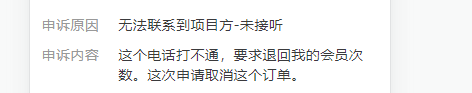

#### app-设置自定义导航栏

```html
<script>
export default {
    created() {
        // 设置自定义导航栏
        this.setNavBar()
    },
    methods: {
        setNavBar() {
            const sendObj = {
                reqType: 'GET_WEB_PAGE_TITLE',
                data: {
                    isHideTitle: true,
                    isShowStatusBar: true,
                    hideSafeAreaView: true,
                    statusBarColor: '#ff3635',
                    navBarColor: '#ff3635',
                    title: ''
                }
            }
            window.sendAppData(sendObj)
        },
        // 自定义返回事件(点击返回icon)
        pageBack() {
            // 存在上一页
            if (window.history.length > 1) {
                this.$router.go(-1)
            } else {
                const sendObj = {
                    reqType: 'GO_BACK',
                    data: {}
                }
                window.sendAppData(sendObj)
            }
        }
    }
}
</script>
```


#### 判断是否微信内嵌环境

> app-h5

```javascript
created() {
	if (this.isMiniwx) {
	    // to...
	}
}
```


#### app-获取token后调接口

> app-h5、team-h5

```javascript
created() {
    this.getAppToken().then(res => {
    	// to...
    }
}
```


#### 兼容获取文档距离顶部距离

兼容web/h5/APP内嵌h5/微信小程序内嵌h5

```vue
<script>
export default {
    mounted() {
        window.addEventListener('scroll', this.handleScroll)
    },
    beforeDestory() {
        window.removeEventListener('scroll', this.handleScroll)
    },
    methods: {
        handleScroll(e) {
            this.onTop = this.isMiniwx
            	// 微信小程序内嵌h5
                ? document.body.scrollTop == 0
            	// pc/移动h5/APP内嵌h5
            	: document.documentElement.scrollTop == 0
        }
    }
}
</script>
```

> 其他的一些位置相关属性，在不同端口上也有类似的差异。


#### 标签、值处理



```less
.detail-item {
    display: flex;
    align-items: flex-start;
    .label {
        margin-right: 40px;
        white-space: nowrap;
    }
    .value {
        flex: 1;
        word-break: break-all;
    }
}
```


#### 微信小程序/APP内嵌H5-使用动态标题

> 这里APP应该用meta.title做了处理

```javascript
export default {
    ...,
    beforeRouteEnter(to, from, next) {
        if (to.path == '/order/xx') {
            const type = to.query.type
            to.meta.title = type == 'edit' ? '修改内容' : '上传内容'
            document.title = type == 'edit' ? '修改内容' : '上传内容'
        }
        next()
    }
}
```


#### 移动端键盘弹出底部按钮隐藏

`测试了有点问题的方案`

> APP进入的第一个页面为当前页面时，似乎没问题；但从内嵌H5继续跳转到该H5时，初始的默认屏幕高度数值总是会大上一些

```html
<div v-show="footerBarShow">demo</div>

<script>
export default {
  data() {
    return {
      footerBarShow: true,
      domHeight: document.documentElement.clientHeight,  //默认屏幕高度
      showHeight: document.documentElement.clientHeight,   //实时屏幕高度
    }
  },
  mounted() {
    window.onresize = () => {
      this.showHeight = document.documentElement.clientHeight;
      this.footerBarShow = (this.domHeight  > this.showHeight) ? false : true
    };
  }
}
</script>
```

`尝试修改后，就没问题了`

> 这里尝试用 `$nextTick` 依旧不行，但用 `setTimeout` 可以

```html
<div v-show="footerBarShow">demo</div>

<script>
export default {
  data() {
    return {
      footerBarShow: true,
      domHeight: null, //默认屏幕高度
      showHeight: null,   //实时屏幕高度
    }
  },
  mounted() {
    setTimeout(() => {
      this.domHeight = document.documentElement.clientHeight
      this.showHeight = document.documentElement.clientHeight
    }, 0)
    window.onresize = () => {
      this.showHeight = document.documentElement.clientHeight;
      this.footerBarShow = (this.domHeight  > this.showHeight) ? false : true
    };
  }
}
</script>
```


